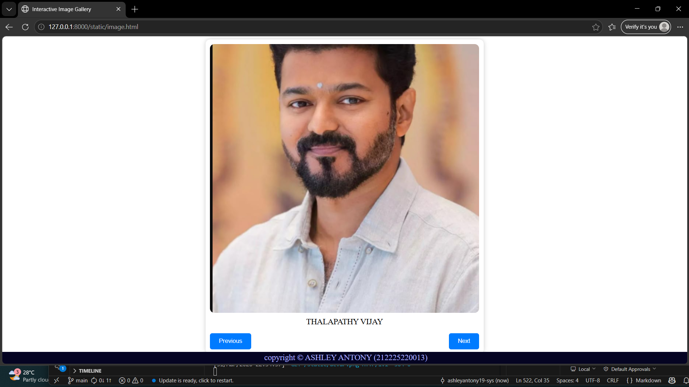
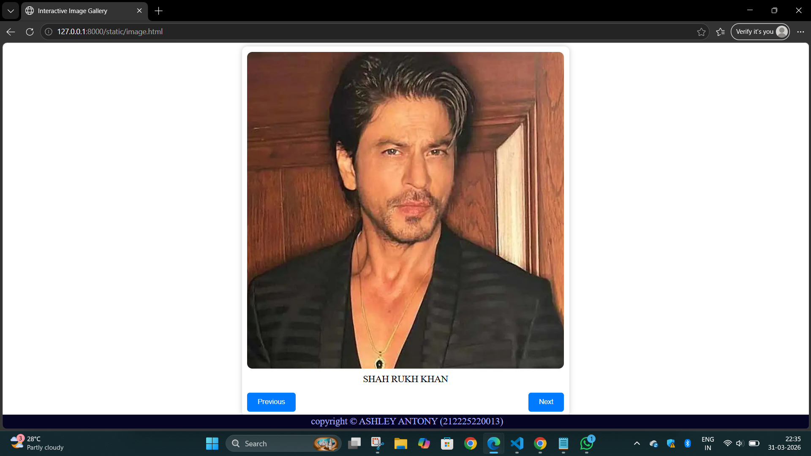
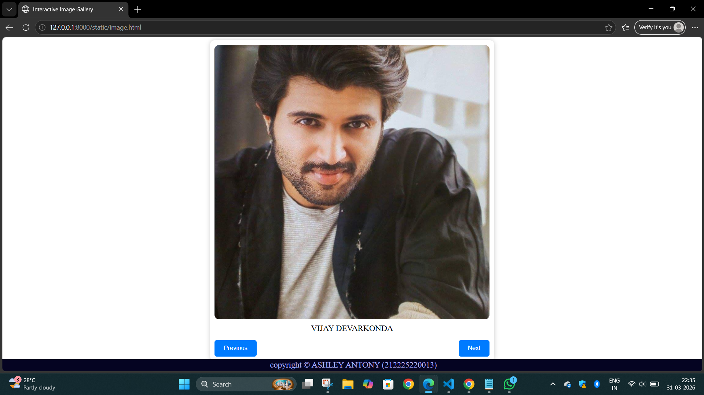
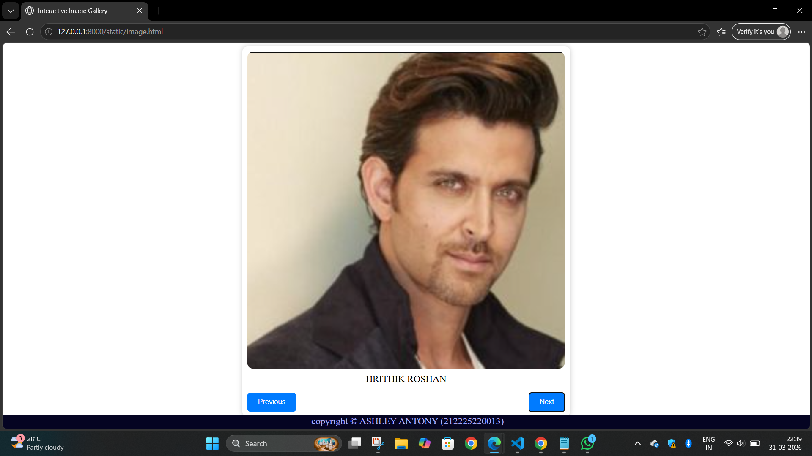

# Ex.08 Design of Interactive Image Gallery
## Date:31.03.2026
## Reference number:25016569

## AIM:
To design a web application for an inteactive image gallery with minimum five images.

## DESIGN STEPS:

### Step 1:
Clone the github repository and create Django admin interface.

### Step 2:
Change settings.py file to allow request from all hosts.

### Step 3:
Use CSS for positioning and styling.

### Step 4:
Write JavaScript program for implementing interactivity.

### Step 5:
Validate the HTML and CSS code.

### Step 6:
Publish the website in the given URL.

## PROGRAM :
```
<html>
<head>
    <title>Interactive Image Gallery</title>
<style>
        	.gallery-container 
{
            position: relative;
            max-width: 600px;
            margin: auto;
            background: white;
            padding: 10px;
            border-radius: 10px;
            box-shadow: 0 0 10px rgba(0, 0, 0, 0.2);
        	}
        	.gallery-image 
{
            width: 600px;
            height: 600px;
            object-fit: cover;
            border-radius: 10px;
        	}
        	.caption 
{
            text-align: center;
            margin-top: 10px;
            font-size: 18px;
        	}
        	.gallery-buttons 
{
            display: flex;
            justify-content: space-between;
            margin-top: 15px;
        	}
        	button 
{
            padding: 10px 20px;
            cursor: pointer;
            border: none;
            border-radius: 5px;
            background-color: #007BFF;
            color: white;
            transition: 0.3s;
        	}
footer
{
    position:fixed;
    background-color: rgb(5, 4, 34);
    left:0;
    bottom:0;
    width:100%;
    color:rgb(172, 176, 253);
    text-align: center;
    font-size: 18px;
    padding: 3px;
}
    	</style>
</head>
<body>
    	<div class="gallery-container">
        		
        		<div id="caption" class="caption">THALAPATHY VIJAY</div>
        		<div class="gallery-buttons">
            		<button onclick="prevImage()">Previous</button>
            		<button onclick="nextImage()">Next</button>
        		</div>
    	</div>
         <footer>
            copyright &copy ASHLEY ANTONY (212225220013)
        </footer>
    	<script>
        		const images = [
{ src: "vijay.png", caption: "THALAPATHY VIJAY" },
{ src: "khan.png", caption: "SHAH RUKH KHAN" },
{ src: "devar.png", caption: "VIJAY DEVARKONDA" },
{ src: "roshan.png", caption: "HRITHIK ROSHAN" }

];
let currentIndex = 0;
        
function updateGallery( ) 
{
document.getElementById("galleryImage").src = images[currentIndex].src;
document.getElementById("caption").textContent = images[currentIndex].caption;
}

function nextImage( ) 
{
currentIndex = (currentIndex + 1) % images.length;
updateGallery( );
}

function prevImage( ) 
{
currentIndex = (currentIndex - 1 + images.length) % images.length;
updateGallery( );
}

</script>
</body>
</html>


```

## OUTPUT:










## RESULT:
The program for designing an interactive image gallery using HTML, CSS and JavaScript is executed successfully.
